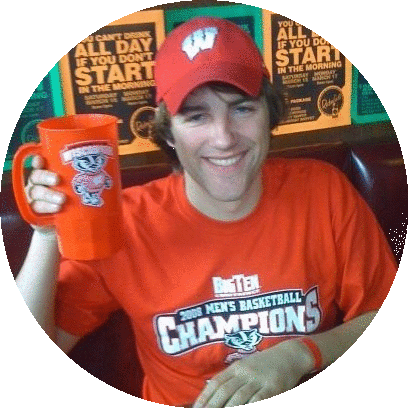

# Marlow
 <a href="https://twitter.com/marlowjr?ref_src=twsrc%5Etfw" class="twitter-follow-button" data-show-count="false">Follow @MarlowJr</a>

this is a blub about Marlow. 

- Live in Chicago
- Have a cat

What else do you need?

# Casey 
   <a href="https://twitter.com/profbadgerfan?ref_src=twsrc%5Etfw" class="twitter-follow-button" data-show-count="false">Follow @profbadgerfan</a>

This is a blurb about Casey 

### Our Story

<form action="https://www.paypal.com/cgi-bin/webscr" method="post">

    <input type="hidden" name="132 Breese"
        value="mbhicksjr@gmail.com">

    <!-- Specify a Donate button. -->
    <input type="hidden" name="cmd" value="_donations">

    <!-- Specify details about the contribution -->
    <input type="hidden" name="item_name" value="132 Breese">
    <input type="hidden" name="item_number" value="Stay Open">
    <input type="hidden" name="currency_code" value="USD">

    <!-- Display the payment button. -->
    <input type="image" name="submit"
    src="https://www.paypalobjects.com/en_US/i/btn/btn_donate_LG.gif"
    alt="Donate">
    

</form>
